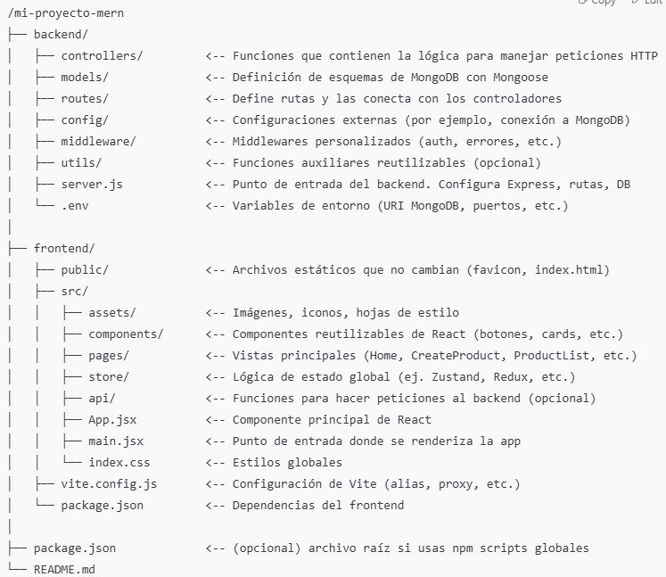

# 🛍️ MERN Product Store

Una aplicación web **full-stack** construida con el stack **MERN** (MongoDB, Express, React, Node.js) que permite a los usuarios **publicar, explorar y comprar productos**. Este proyecto ha sido desarrollado como parte de un **trabajo académico** con fines educativos.

---

## 🚀 Tecnologías Utilizadas

- 🧠 **MongoDB**: Base de datos NoSQL para almacenar productos y usuarios.
- 🚂 **Express.js**: Framework minimalista para Node.js que facilita el manejo del backend.
- ⚙️ **Node.js**: Entorno de ejecución del servidor.
- 🌐 **React**: Librería frontend para construir interfaces dinámicas.
- 🔒 **dotenv**: Para manejo seguro de variables de entorno.

---

## 🖥️ Instalación y Ejecución

> Asegúrate de tener instalado **Node.js** y **MongoDB** localmente.

---

## 📘 Créditos
Este proyecto fue inspirado y guiado por el excelente tutorial de freeCodeCamp en YouTube.
📺 Ver el tutorial aquí: https://www.youtube.com/watch?v=O3BUHwfHf84&t=4520s

Agradecimientos a freeCodeCamp.org por el contenido educativo de calidad.

Repositorio Github tutorial: https://github.com/burakorkmez/mern-crash-course

---

## 👨‍🎓 Propósito Académico
Este proyecto fue desarrollado con el objetivo de aprender sobre el desarrollo web moderno utilizando una arquitectura full-stack real. No está destinado para uso en producción y no reclamo ser autor del código.

---

## Aprendizajes
1. Arquitectura general
- Frontend (React): Es la interfaz de usuario. Los componentes React muestran páginas y formularios y llaman a funciones para realizar acciones, como crear un producto.
- Backend (Node + Express): Gestiona la lógica del negocio y conecta con la base de datos. Expone una API REST para que el frontend pueda consultar y enviar datos.
- Base de datos (MongoDB + Mongoose): Guarda los datos de forma persistente, usando modelos que representan colecciones y documentos.

2. Flujo básico para crear un producto Frontend (React)
- El usuario llena un formulario en un componente React (ejemplo: CreatePage.jsx).
- Al hacer submit, se llama a una función que:
- Usa un store global (en este caso con Zustand) para manejar estado y acciones.
- Esa función (createProduct) hace una llamada HTTP POST a la API del backend enviando los datos del producto.

// Componente React que crea un producto
const { createProduct } = useProductStore();

const handleAddProduct = async () => {
  const { success, message } = await createProduct(newProduct);
  // muestra mensaje al usuario...
};

- La función createProduct (en store/product.js) usa fetch para enviar los datos al backend:

createProduct: async (newProduct) => {
  const res = await fetch("/api/products", {
    method: "POST",
    headers: { "Content-Type": "application/json" },
    body: JSON.stringify(newProduct),
  });
  const data = await res.json();
  // Actualiza estado con el nuevo producto recibido
  set(state => ({ products: [...state.products, data.data] }));
  return { success: true, message: "Product created successfully" };
}

Backend (Express + Mongoose)
- Express tiene un router que detecta la ruta /api/products y método POST y ejecuta la función controladora (controller) encargada.

// routes/productRoutes.js
const express = require('express');
const router = express.Router();
const { createProduct } = require('../controllers/productController');

router.post('/', createProduct);

La función createProduct está en el controlador y contiene la lógica de negocio para crear el producto:

// controllers/productController.js
const Product = require('../models/productModel');

const createProduct = async (req, res) => {
  try {
    const { name, price, image } = req.body;
    const product = new Product({ name, price, image });
    const savedProduct = await product.save();  // Guarda en MongoDB
    res.status(201).json({ data: savedProduct });
  } catch (error) {
    res.status(500).json({ message: error.message });
  }
};

Modelo (Mongoose)
- Define la estructura que tendrán los productos en la base de datos (MongoDB):

// models/productModel.js
const mongoose = require('mongoose');

const productSchema = new mongoose.Schema({
  name: { type: String, required: true },
  price: { type: Number, required: true },
  image: { type: String, required: true }
});

const Product = mongoose.model('Product', productSchema);

## Gestión de Ficheros General MERN
